# 유저 시나리오 및 플로우 다이어그램

## 대시보드 종목 관리 플로우

### 전체 플로우 다이어그램

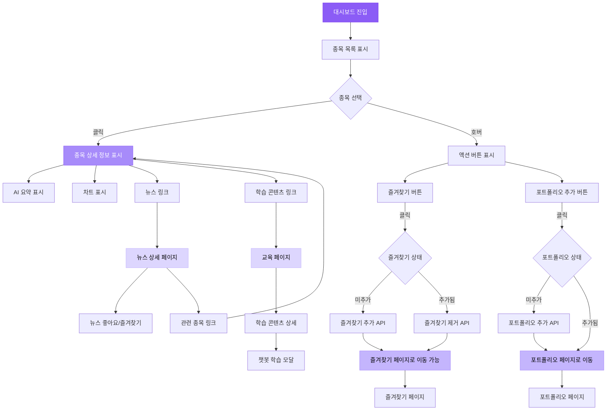

## 페이지별 상세 플로우

### 1. 대시보드 페이지

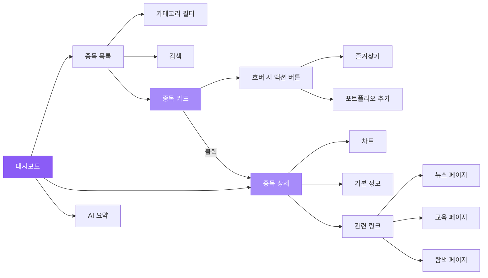

### 2. 종목 상세 → 다른 페이지 연결

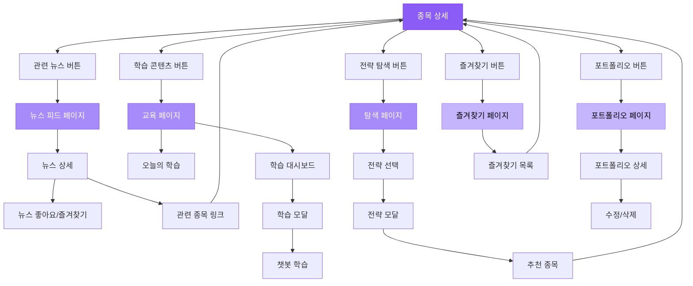

### 3. 뉴스 페이지 플로우

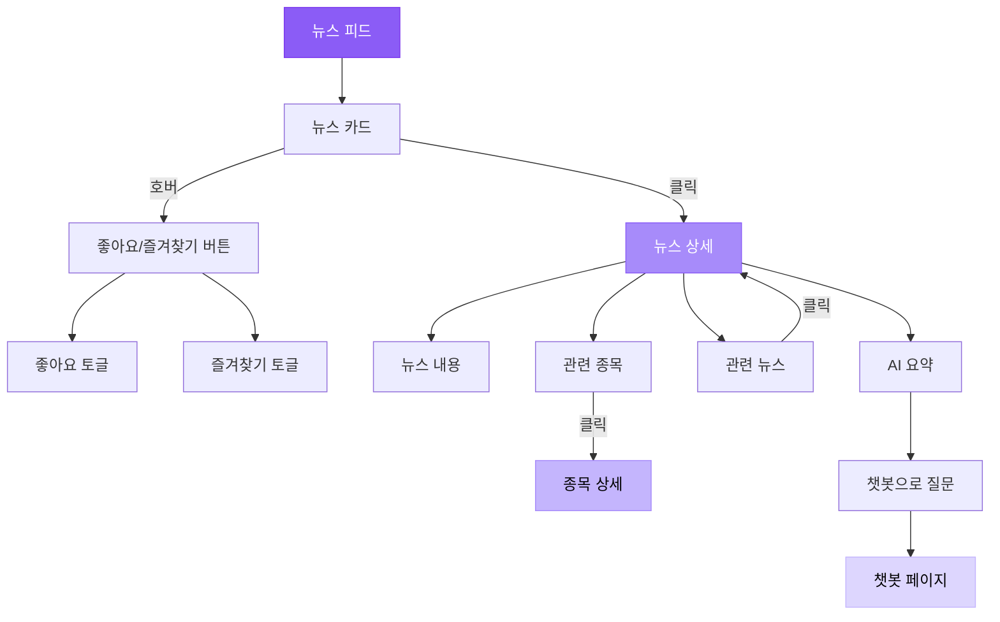

### 4. 교육 페이지 플로우

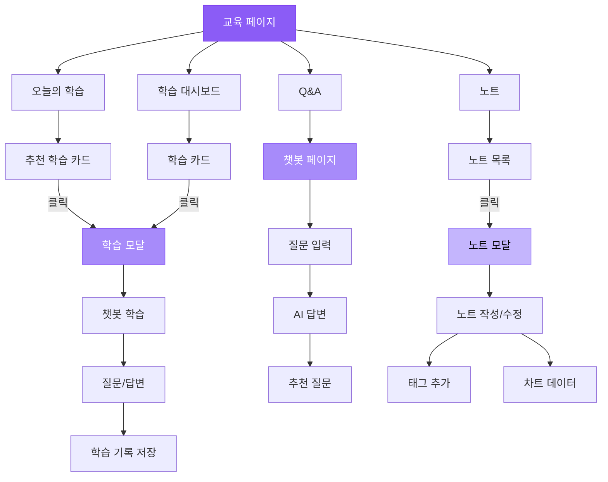

### 5. 탐색 페이지 플로우

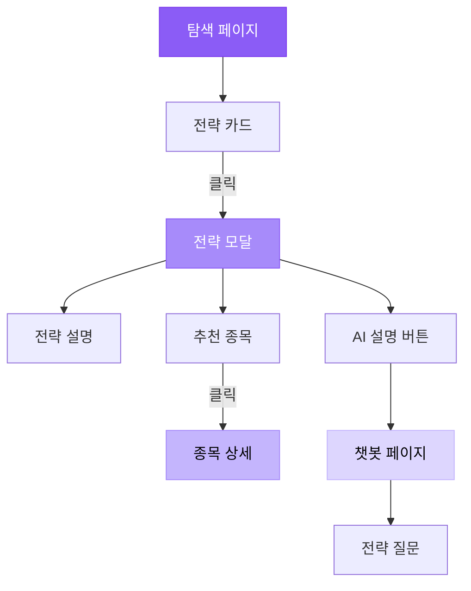

### 6. 포트폴리오 페이지 플로우

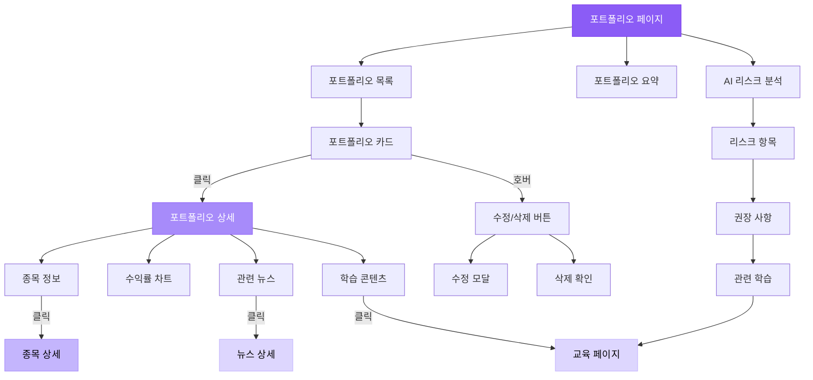

### 7. 즐겨찾기 페이지 플로우

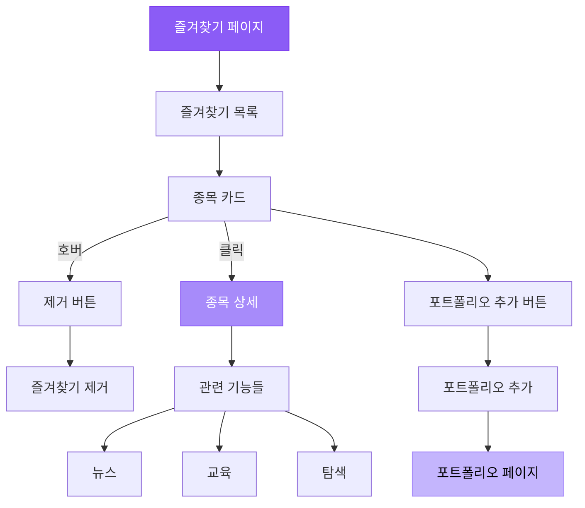

## 크로스 페이지 네비게이션 맵

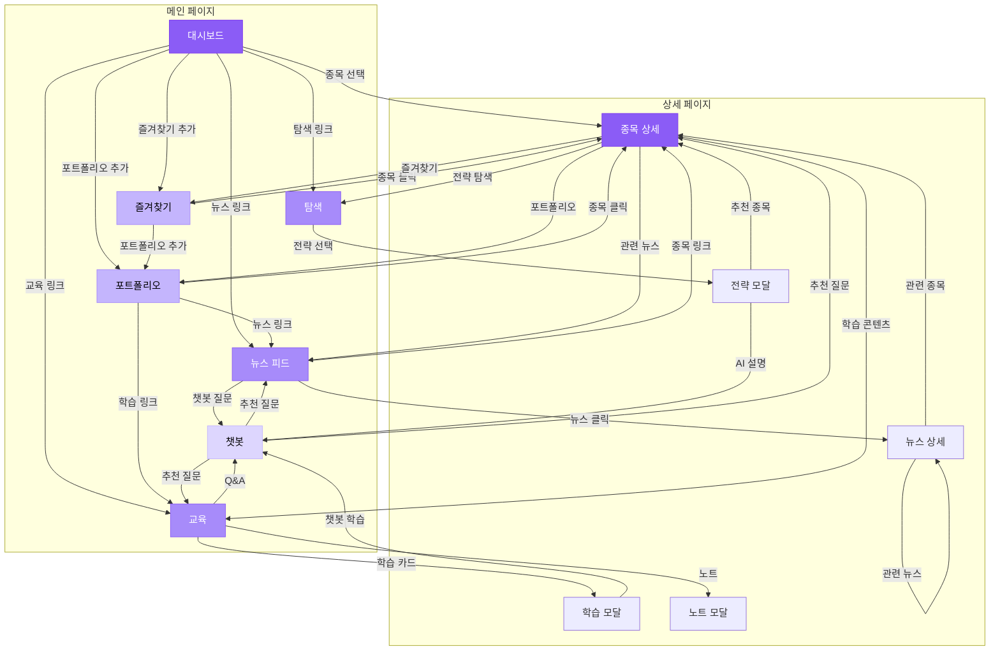

## 주요 액션 플로우

### 액션 1: 종목 즐겨찾기 추가

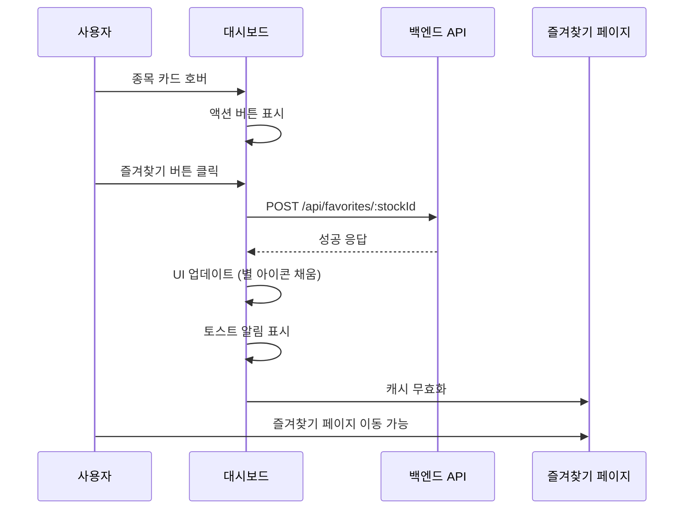

### 액션 2: 포트폴리오 추가

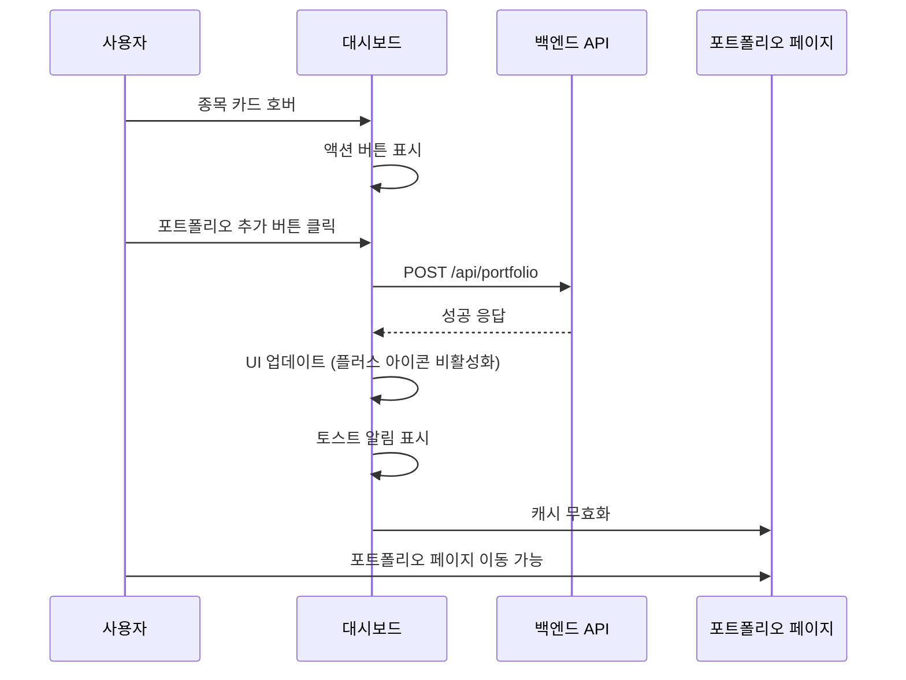

### 액션 3: 종목 상세에서 다른 페이지로 이동

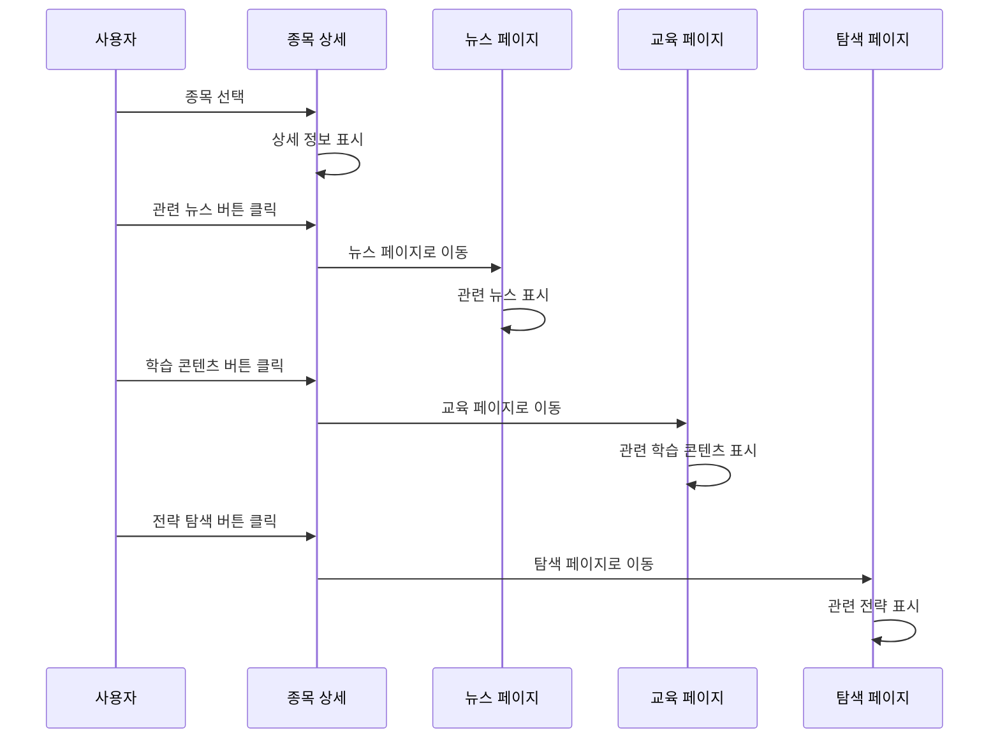

## 구현 우선순위

### Phase 1: 핵심 기능 (완료)
- ✅ 종목 목록 표시
- ✅ 종목 상세 정보
- ✅ 즐겨찾기 추가/제거
- ✅ 포트폴리오 추가

### Phase 2: 페이지 연결 (진행 중)
- ✅ 종목 상세에서 뉴스 링크
- ✅ 종목 상세에서 교육 링크
- ✅ 종목 상세에서 탐색 링크
- ⏳ 뉴스에서 종목 링크
- ⏳ 교육에서 종목 링크
- ⏳ 탐색에서 종목 링크

### Phase 3: 고급 기능 (예정)
- ⏳ 포트폴리오 추가 모달 (수량 입력)
- ⏳ 일괄 액션
- ⏳ 키보드 단축키
- ⏳ 드래그 앤 드롭
